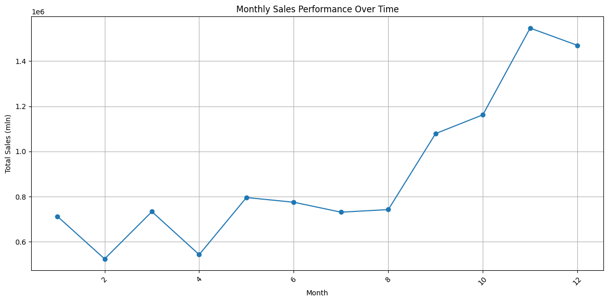

# Retail Sales Analysis Project

This project aims to analyze retail sales data to derive meaningful insights into sales performance, product performance, and geographical sales distribution. The goal is to help businesses understand customer behavior, product trends, and regional sales patterns to optimize decision-making.

## Project Overview

The analysis focuses on the following key aspects:
1. **Sales Performance Analysis**: Examines overall sales trends over time, identifying peak sales periods and the performance of different stores.
2. **Product Performance Analysis**: Investigates which products drive the most revenue and what product categories are most profitable.
3. **Geographical Sales Analysis**: Analyzes how sales vary across different regions, helping identify high-performing locations and potential areas for improvement.

## Dataset

The dataset used for this analysis contains detailed sales records, including information on products, customers, and locations. Rows with canceled orders (identified by negative quantities) were filtered out to ensure accurate analysis.

## Key Analyses

### 1. Sales Performance Analysis
- **Monthly and daily sales trends** were plotted to visualize revenue growth and seasonality.

#### Daily sales

#### Monthly sales

### 2. Product Performance Analysis
- **Top products by revenue and quantity** were identified and plotted, showing which products contributed the most to overall sales.

#### Top 10 products by revenue

#### Monthly sales

### 3. Geographical Sales Analysis
- **Regional sales trends** were examined to pinpoint the locations with the highest sales performance.

## Tools and Technologies

- **Python**: Data manipulation and analysis using pandas and numpy.
- **Matplotlib**: Visualization of sales and performance trends.

